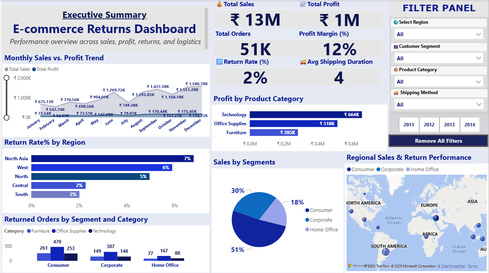
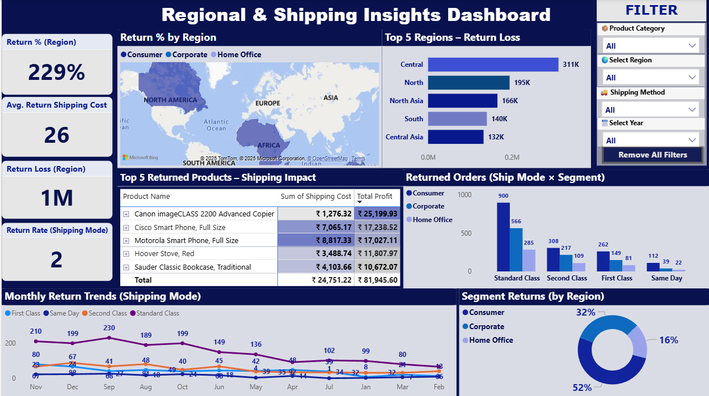
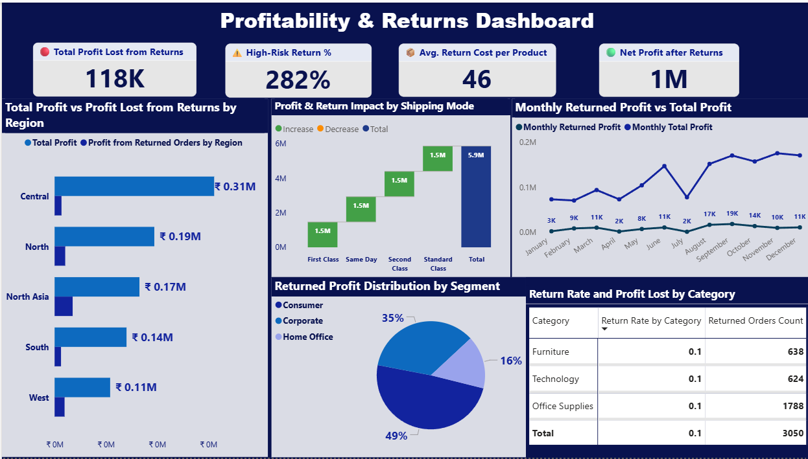
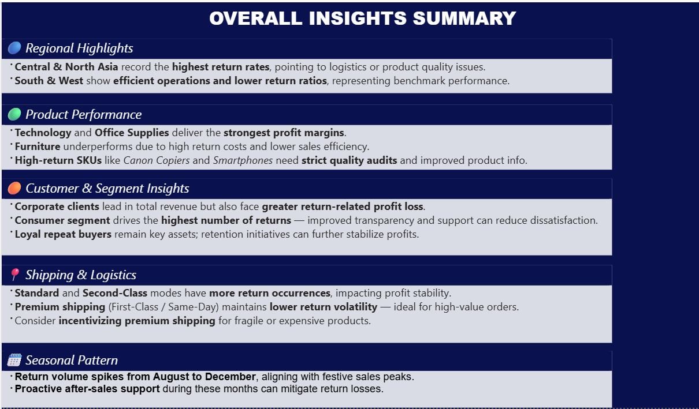
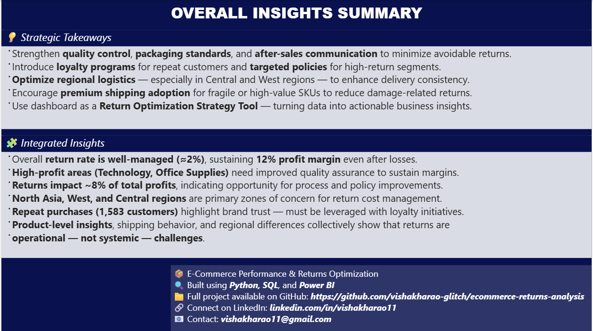

# 📊 Power BI | E-commerce Returns Dashboard Suite

This folder contains six interactive dashboards built in Power BI to analyze and optimize product returns in an e-commerce business. Each dashboard is designed to surface actionable insights across product categories, customer segments, regions, and shipping modes.

---

## 🧠 Purpose  
To visualize return behavior and its impact on profitability, logistics, and customer satisfaction—turning raw metrics into strategic decisions.

---

## 📊 Dashboard Previews

Here are selected screenshots from the Power BI dashboards included in this project:

### 1. Executive Summary  

### 2. Regional & Shipping Insights  

### 3. Product & Customer Insights  

### 4. Profit Impact Dashboard  

### 5. Overall Insights Summary  

### 6. Overall Insights Summary  

---

## 🔍 Dashboard Highlights  
- 📌 ₹13M Sales | ₹1M Profit | 23% Return Rate  
- 📌 60% of returns from 3 categories  
- 📌 First-time buyers most likely to return  
- 📌 Premium shipping reduces return volatility  
- 📌 Return spikes during festive months (Aug–Dec)  
- 📌 Strategic actions: loyalty programs, quality audits, shipping incentives

---

## 📈 Business Value  
These dashboards help stakeholders:
- Identify high-risk products and regions  
- Optimize shipping strategies  
- Improve product descriptions and customer support  
- Reduce return-related losses and improve retention

---

## 📂 Folder Structure  
- `dashboard_screenshots/`: Contains all six dashboard visuals  
- `.pbix` file (optional): Available upon request or hosted externally  
- `README.md`: Documentation for dashboard logic and business framing
